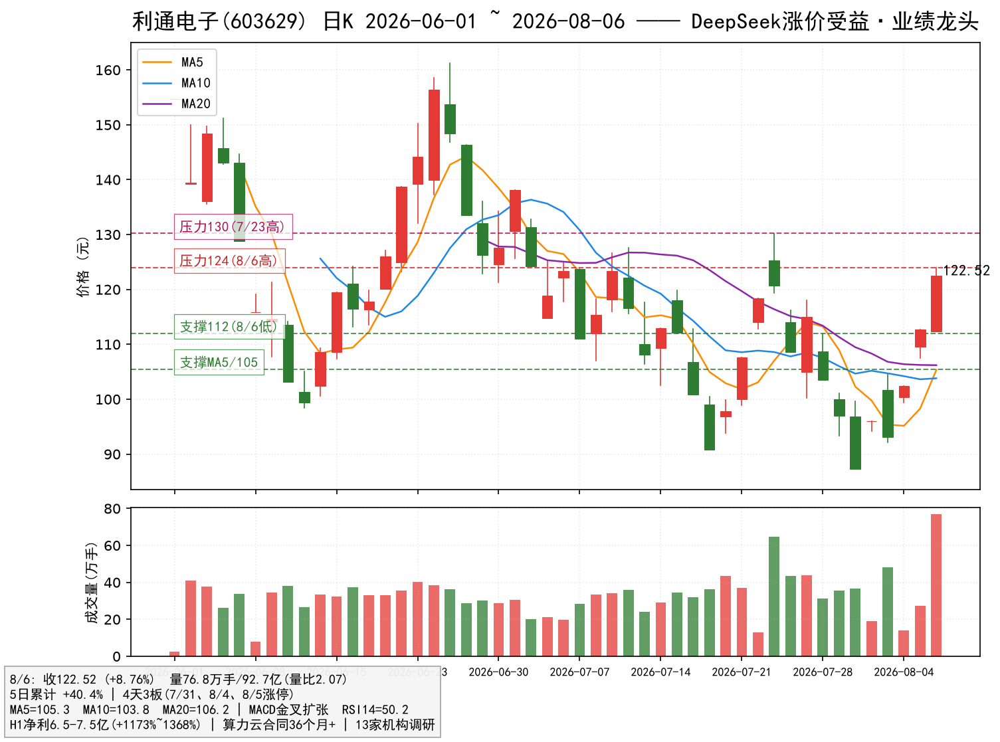
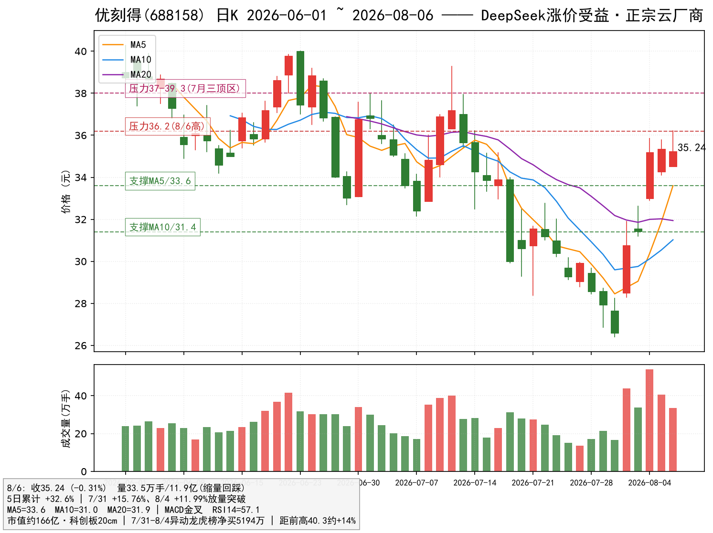

# DeepSeek API 大幅涨价事件 —— A股受益标的锁定报告（逻辑×数据双确认版）

> 报告日期：2026-08-06（收盘后）｜数据源：日K 2026-06-01 ~ 2026-08-06（48 个交易日）+ AI行情官 实时评分/信号｜性质：事件驱动题材研究
> 声明：本报告仅为研究与信息整理，**不构成任何投资建议**。股市有风险，入市需谨慎。

---

## 一、事件与产业逻辑核实（逻辑关：定方向）

**事件**：DeepSeek 官方后台预告"计划近期整体上调 API 定价、预计涨幅较大"；7 月中旬已先行引入峰谷定价（高峰时段 2 倍）；V4-Flash 已调价、V4 Pro 发布临近。行业侧同步共振：智谱 Q1 提价 83% 后用量仍增长 400%，月之暗面也已提价——头部大模型厂商集体验证"**涨价但需求不降**"。

**传导链条**：API 涨价 → 推理成本上升但需求刚性 → 算力供给紧张 → **算力租赁价格与云厂商定价权同步上行** → 拥有自有 GPU 算力 / 云业务的上市公司收入弹性最大。

**产业数据**（权威口径）：
- 国家数据局：算力租赁市场规模 2025 年 328 亿 → 2026Q1 已 680 亿，全年或超 2600 亿；
- 信通院：2026Q1 算力需求同比 +417%，而供给仅 +128%，供需缺口持续扩大。

**受益路径排序**（弹性从高到低）：
1. 算力租赁商 / 云厂商（按量计费，涨价直接传导收入）——**最直接**；
2. 拥有自有 GPU 资源的 IDC / 算力运营——次之；
3. AI 服务器等硬件大票——涨价利多需求，但股价弹性钝化，且多数已处高位。

**逻辑关校验（剔除伪受益）**：
- 并行科技：市场流传"DeepSeek 上游算力供应商"，但公司官方 2025-02、2026-04 两次公告明确"**尚未与深度求索（DeepSeek）建立算力服务业务合作关系**"，传言未经证实 → 逻辑关不过；
- 中嘉博创：8/6 直线涨停，但**无自有 GPU 算力**、算力业务占比微，扭亏靠一次性司法债权回款 1.3 亿 → 逻辑关不过。

**结论**：事件成立；真正的受益者是"算力租赁 + 云厂商"环节，且必须是"真算力 + 有业绩/位置弹性"的标的。

---

## 二、方法论：为什么是"逻辑 × 数据"双确认（本次优化核心）

**先正面回答一个问题**：选股到底靠大模型推理，还是靠 AI行情官 走出来的真实交易数据信号？——**两者不是二选一，而是两道不同的工序**：

| 工序 | 解决的问题 | 工具 | 单用一端的失效风险 |
|---|---|---|---|
| 逻辑确认 | **买什么**（方向） | 产业传导链、公司公告、基本面、位置/估值/赔率 | 只看逻辑 → 买到"逻辑对但趋势未启动 / 已透支"的票 |
| 数据确认 | **何时买、拿不拿得住**（时点） | 盘面资金、量价结构、技术位、AI行情官 评分/信号 | 只看信号 → 买到"技术强但公司不真受益"的题材壳 |

**双确认流程**：逻辑关（产业关联度 / 基本面 / 位置赔率）→ 数据关（资金 / 量价 / 技术评分）→ **两关都过才入选，任一不过即淘汰**。

**三个案例印证框架必要性**：
1. **宏景科技评分 66.6（三强中最高）却被剔除**：数据关几乎全过，但逻辑关"位置已透支（相对 6/1 +17.6%）、机构目标价 178.68 < 现价 199.6、上方套牢盘重"不过 → 证明**评分高 ≠ 能买**；
2. **优刻得评分 56.4（三强中最低）却入选核心仓**：两关都过——位置低（AI行情官 位置 33%）+ 形态最干净 + 20cm 赔率最优 → 证明**评分是"体检报告"，不是"选股结论"**；
3. **并行科技 / 中嘉博创**：无论当日异动信号多强，逻辑关直接不过 → 不碰。

**AI行情官 大盘环境**（2026-08-06）：上证指数 pts=3.0（**顺风**），大盘 MACD 翻红·第 3 天、站上 MA20——题材炒作有指数环境支撑。

---

## 三、三强 AI行情官 评分快照对比（数据关：技术体检）

> 数据来自 AI行情官「信号分享卡」实时接口（K线信号 + 技术快照评分），2026-08-06 收盘后抓取，仅作技术状态统计，不构成推荐。

| 项目 | 利通电子 603629 | 优刻得 688158 | 宏景科技 301396 |
|---|---|---|---|
| **综合评分** | **68.4** | 56.4 | 66.6 |
| 正向信号标签 | MACD翻红·第2天 / 红柱放大 / 均线金叉×2 / 站上MA20 / 价升量增 / 异动回踩中 / 位置41% / 动能健康 / 波动收敛 | MACD翻红·第4天 / 红柱放大 / 均线金叉 / 站上MA20 / 异动回踩中 / 位置33% / 动能偏热 / 量价配合 | MACD翻红·第1天 / 红柱放大 / 均线金叉 / 站上MA20 / 温和放量 / 异动回踩中 / 位置34% / 动能健康 |
| 风险标签 | 量价背离 / 多次跌停 / 5日涨幅过大 | 涨停开板 / 5日涨幅过大 | 量价背离 / 长上影滞涨 / 涨停开板 / 5日涨幅过大 |
| 评分因子亮点 | MACD 24 / 量能 11 / MA 8（强） | 量价配合 +6.4（三者唯一正贡献） | MACD 25 / 量能 9（强） |

**读表要点**：
- 三只票**技术上都已确认"趋势启动"**（均站上 MA20、MACD 翻红、红柱放大）——这是能进决赛的数据前提；
- 利通评分最高、正面标签最多，但风险标签含"量价背离 / 多次跌停"，对应其高位连板属性，追高需谨慎；
- 优刻得评分最低，但"量价配合 +6.4"是三者中唯一正贡献的量价因子，对应其"突破后缩量回踩"的最干净形态；
- 宏景"长上影滞涨"标签对应 8/6 冲高回落——数据关里的首个预警信号。

---

## 四、8/6 盘面验证（数据关：资金确认）

8/6 上证收 3900.35（+0.57%），东数西算/算力板块 +1.01%，大盘环境顺风（pts=3.0）。算力租赁概念异动当日，资金真实流向：

| 表现 | 说明 |
|---|---|
| 中嘉博创(000889) | 直线涨停——但无自有 GPU 算力，题材属性>基本面，逻辑关淘汰 |
| **利通电子(603629)** | **+8.76% 放量续攻，当日算力租赁核心之一** |
| **优刻得(688158)** | **缩量回踩未破位，突破平台后的正常整理** |
| 中贝通信 | 跟风异动 |
| 浪潮信息 / 并行科技 | 分别 -0.53% / -3.03%，**大市值/已高位标的不获资金认可** |

> 关键信号：事件当日，资金明显回避"硬件大票"与"高位已透支票"，流向"真算力 + 小市值 + 有业绩弹性"的标的——**资金行为与产业逻辑互相印证**。

---

## 五、候选标的筛选（6 只 → 2 只，双确认淘汰记录）

| 标的 | 逻辑关 | 数据关 | 裁决 |
|---|---|---|---|
| 中嘉博创(000889) | ✗ 无自有 GPU、算力占比微、扭亏靠一次性回款 | 直线涨停但纯题材 | 淘汰 |
| 青云科技(688316) | △ 有云业务 | ✗ 8/4 二十厘米涨停后 8/6 冲高回落 -4.13%（收 54.83），主力净流出 1545 万 | 淘汰 |
| 浪潮信息(000977) | △ AI 服务器龙头（间接受益） | ✗ 8/6 -0.53%，上方 MA20≈81 压制，资金未认可 | 观察 |
| 并行科技(920493) | ✗ 官方两次否认与 DeepSeek 合作 | ✗ 8/6 -3.03%，已高位、弹性不足 | 淘汰 |
| **利通电子(603629)** | ✓ 算力租赁核心、H1 业绩 +1173%~1368% | ✓ 评分 68.4、放量续攻 | **入选** |
| **优刻得(688158)** | ✓ 正宗云厂商、传导链最短 | ✓ 评分 56.4、突破后缩量回踩 | **入选** |
| 宏景科技(301396) | ✗ 位置透支、目标价倒挂 | △ 评分 66.6 最高，但 8/6 长上影滞涨 | 决赛后剔除 |

---

## 六、决赛三强横向对比（2026-08-06 收盘）

| 指标 | 利通电子 603629 | 优刻得 688158 | 宏景科技 301396 |
|---|---|---|---|
| AI行情官 评分 | **68.4** | 56.4 | 66.6 |
| 收盘价 / 当日涨跌 | 122.52 / **+8.76%** | 35.24 / -0.31% | 199.60 / +0.35% |
| 5日累计涨幅 | **+40.4%**（3个涨停） | +32.6% | +53.4%（2个20cm板） |
| 8/6 量能 | **76.8万手 / 92.7亿**（天量） | 33.5万手 / 11.9亿（缩量） | 26.7万手 / 53.0亿 |
| MA5 / MA10 / MA20 | 105.3 / 103.8 / 106.2 | 33.6 / 31.0 / 31.9 | 175.7 / 167.9 / 192.6 |
| MACD | 金叉扩张（HIST +4.43） | 金叉（HIST +1.62） | 金叉（HIST +2.75） |
| RSI14 | 50.2（未超买） | 57.1（健康） | 50.3 |
| ATR14（日波动） | 11.4（≈9.3%） | 2.5（≈7.1%） | 25.8（≈12.9%） |
| 48日区间分位 | ≈48% | ≈64% | ≈34% |
| 相对6/1起点 | -20.8% | -9.0% | **+17.6%（已透支）** |
| 市值 / 弹性 | 约300亿级 / 10cm | **约166亿 / 20cm** | 429亿 / 20cm |
| 基本面 | H1净利6.5~7.5亿 **+1173%~1368%**；算力云合同均36个月+；13家机构调研 | 正宗公有云/GPU云厂商；Q1营收4.39亿(+16.8%)、净利薄；异动龙虎榜净买5194万 | 头部算力租赁；Q1净利+40%；机构上调2026E至3.81亿；5日DDX=6.39（主力最强） |
| 主要风险 | 高位连板、天量换手、量价背离 | 业绩薄、题材驱动 | 目标价178.68 < 现价199.6；套牢盘重；长上影滞涨 |

---

## 七、最终锁定 2 只

### 7.1 利通电子（603629）—— "业绩+题材"双确认龙头

**逻辑确认**：① 算力租赁核心环节（AI行情官 评分 68.4、正面标签 9 条，三强中最多）；② 基本面三者中最硬：H1 净利 6.5~7.5 亿、同比 +1173%~1368%，算力云合同均在 36 个月以上（收入锁定性强），13 家机构调研。

**数据确认**：8/6 当日算力租赁领涨核心之一，3 板之后仍 +8.76% 放量（92.7 亿元天量），资金态度最坚决；技术上连板但 RSI 仅 50.2、MACD 金叉扩张，尚未进入超买区。

**近期走势与交易量**：7/30 见底 87.28（-9.97%）→ 7/31 涨停 → 8/3 洗盘 -3.03% → 8/4、8/5 连续涨停 → 8/6 高开高走 +8.76%，收 122.52，成交 **76.8万手 / 92.7亿**，天量确认资金进场。

**技术位与操作**：
- 支撑：112（8/6 低点）→ 107~109（8/5 涨停平台）→ 105（MA5）→ 104（MA10，生命线）
- 压力：124（8/6 高点）→ 130（7/23 高点）→ 138（7/1 高点）→ 154~161（6 月高位区）
- 买点：回踩 107~112 不破企稳可轻仓接力；放量再封板确认可跟随
- 止损：跌破 104（MA10）或单日放量长阴 -8% 无条件离场
- 仓位：风险最高，单票 ≤1 成试错
- ⚠️ 8/6 天量 92.7 亿后，若 8/7 缩量滞涨或炸板，立即兑现不恋战（评分"量价背离 / 5日涨幅过大"标签即高位风险提示）

### 7.2 优刻得（688158）—— "正宗云厂商 + 20cm 弹性"最佳赔率

**逻辑确认**：① 正宗公有云/GPU 云厂商，DeepSeek API 涨价 → 推理算力价格上行 → 云厂商按量计费收入直接受益，**传导链最短**；② 市值仅约 166 亿，科创板 20cm，三者中赔率最优；③ 位置低（AI行情官 位置 33%、相对 6/1 起点 -9.0%），上方无深套筹码。

**数据确认**：① 7/31~8/4 三日涨幅偏离 30% 触发异动、龙虎榜净买 5194 万，资金已建仓；② 评分 56.4 中"量价配合 +6.4"为三者唯一正贡献量价因子；③ 技术形态最干净：放量突破后**缩量回踩 2 日不破位**，典型的"突破后整理"而非"见顶"。

**近期走势与交易量**：7/30 低点 26.58 → 7/31 +15.76%、8/4 +11.99% 放量突破（8/4 量 53.8万手为阶段峰值）→ 8/5 +0.43%、8/6 -0.31% 缩量整理（8/6 量 33.5万手、量比<1），站稳 MA5（33.6），MACD 金叉、RSI 57.1 健康，距前高 40.3 仍有约 +14% 空间。

**技术位与操作**：
- 支撑：33.6（MA5）→ 32.9（8/4 低点）→ 31.2~31.4（8/3 低点 / MA10 区域）
- 压力：36.2（8/6 高点）→ 37.9~39.3（7月三顶密集区）→ 40.3（6/1 前高）
- 买点：回踩 33~34 不破分批建仓；放量突破 36.2 加仓
- 止损：跌破 31.4（MA10）离场
- 目标：37.9~39.3 减半兑现；放量突破 40.3 则打开新高空间
- 仓位：可作本次事件主仓，单票 ≤2 成

### 7.3 为何不选宏景科技（301396）—— 评分最高却被双确认剔除的典型案例

宏景科技 AI行情官 评分 66.6（仅次于利通）、5 日 DDX=6.39（主力资金三人中最强）、20cm 弹性，数据关看似全过，但四点硬伤让其倒在逻辑关：
1. **反弹已透支**：相对 6/1 起点已 +17.6%（利通 -20.8%、优刻得 -9.0%），5 日 +53.4% 后 8/6 动能熄火（+0.35%）；
2. **机构目标价已破**：机构目标价 178.68 < 现价 199.6，安全边际为负；
3. **上方套牢盘重**：7/1 高点 339 → 7/30 低点 127 单月 -62%，现价仍处 -41% 深水区，230~340 区间套牢盘巨大；
4. **回撤风险不对称**：ATR 日波动 ≈13%，20cm 一旦退潮单日 -15% 级别回撤，赔率远差于前两者；且 8/6 评分新增"长上影滞涨"标签，动能已现衰减。

**观察条件**：若回踩 MA20（192）不破、再度放量拉 20cm，可重新纳入短线博弈。

---

## 八、组合策略与风控

| 项目 | 建议 |
|---|---|
| 总仓位 | 事件驱动博弈，**总仓位 ≤3 成**，不满仓 |
| 核心仓 | 优刻得（≤2 成）：回踩 33~34 低吸 / 破 36.2 加仓 |
| 弹性仓 | 利通电子（≤1 成）：仅回踩 107~112 企稳或涨停确认接力，不追高开 >5% |
| 止损纪律 | 破关键支撑或单日放量长阴（-8% 以上）无条件离场 |
| 时间窗 | DeepSeek 正式调价公告落地前后 1~2 日为催化窗口；公告延期/涨幅不及预期 → 减仓兑现 |
| 跟踪指标 | ① 两票次日量能（利通缩至 30 万手以下=滞涨信号）② 算力租赁/东数西算板块成交额 ③ 龙虎榜主力动向 ④ DeepSeek 官方公告 ⑤ AI行情官 评分变化（掉出 50 分或新增"险"信号=减仓预警） |

---

## 九、风险提示

1. 本事件为题材驱动博弈，情绪退潮时 20cm 与连板股回撤极快，"题材>业绩"的标的可能 A 字回落；
2. 优刻得净利薄（Q1 仅 274 万），若算力价格上涨未能传导至收入端，行情缺乏业绩支撑；
3. 利通电子已 3 连板并放出 92.7 亿天量，追高者面临 天地板/炸板 风险，务必控制仓位与止损；
4. 并行科技"DeepSeek 上游供应商"为市场传闻，公司官方已两次否认，相关标的勿凭传言博弈；
5. AI行情官 评分/信号为技术统计工具，反映历史量价状态，不代表未来走势，也不构成任何买卖推荐；
6. 相关公告、调研数据来自公开渠道整理，可能存在滞后或口径差异，请以公司公告为准；
7. **本报告不构成投资建议**，据此操作风险自负。

---

*报告生成：AI行情官智能体｜数据截至 2026-08-06 收盘｜方法：逻辑 × 数据双确认*
*附录：AI行情官 评分/信号抓取自 a.ai24x.com 本地调试服务（127.0.0.1:18011），原始数据存 `数据/score_20260806.json`；文末分享卡由「信号分享卡」模块生成，含邀请码 BWPX3Z8B 便于注册转化统计。*