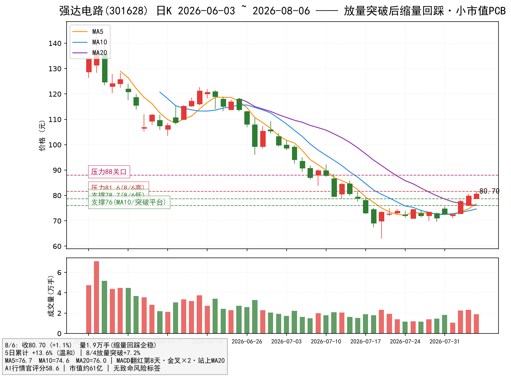
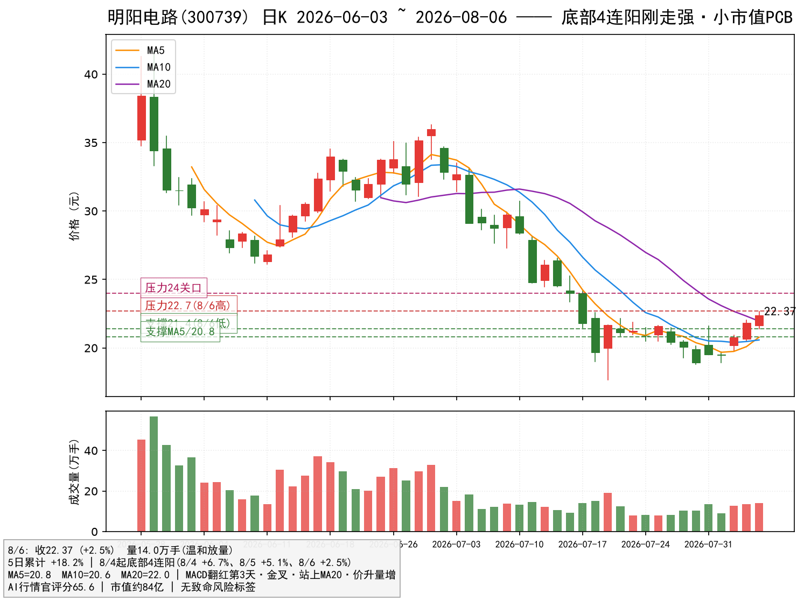

# PCB 潜力龙头调研（低风险优化版）—— 强达电路(301628) × 明阳电路(300739)

> 报告日期：2026-08-07（数据截至 2026-08-06 收盘）｜性质：板块内个股深度研究（PCB 主线 · 小市值低风险优选）
> 数据源：AI行情官 评分/信号 + 日K（前复权）+ 东财/腾讯行情
> 声明：本报告仅为研究与信息整理，**不构成任何投资建议**。股市有风险，入市需谨慎。

---

## 〇、为什么要出这个"优化版"（先回答你的风控疑问）

你提的风险完全成立，本轮做一次系统性修正：

**原版的问题**：上一版锁定的深南电路、沪电股份虽是 AI PCB 龙头，但 5 日已累计上涨 +21%~+24%，板块整体 5 日涨幅 20%+——属于"**行情中段追高**"，短线回撤风险偏大；且两者市值 2200~2400 亿，**不可能有"暴涨"弹性**（单日 10cm 涨停对 2400 亿市值只是毛毛雨）。

**优化版的标准**（你的建议，已固化为筛选规则）：
1. **底部刚走强**：位置 ≤30%、刚站上 MA20/均线金叉初期（MACD 翻红第 1~8 天）；
2. **形态健康**：放量突破后缩量回踩企稳、或底部连阳温和放量——**拒绝 5 日涨幅过大、拒绝连板透支**；
3. **小市值弹性**：市值 30~150 亿（暴涨空间大，游资/主力可撬动）；
4. **排除不可能暴涨的**：剔除市值过大、ST、主业不纯、破位下行、多次跌停、流动性枯竭的标的。

按此规则对 PCB 板块 **164 只成分股**全量扫描 → 精选 20 只 PCB 主业小市值标的 → AI行情官 逐只体检 → **最终锁定 2 只**：**强达电路(301628)**、**明阳电路(300739)**。

---

## 一、候选筛选：164 只 → 20 只 → 2 只

### 1.1 筛选漏斗
| 步骤 | 规则 | 结果 |
|---|---|---|
| 全量 | PCB 概念板块成分 | 164 只 |
| 市值过滤 | 总市值 30~300 亿（排除大市值） | 115 只 |
| 主业过滤 | 印制电路板制造/直接相关主业 | 约 20 只 |
| 技术体检 | AI行情官 评分/信号（位置、MACD、金叉、MA20、风险标签） | 6 只入围 |
| 形态终选 | 底部刚启动/突破回踩/小突破 + 无致命风险 | **2 只** |

### 1.2 入围 6 只对比（2026-08-06 收盘）

| 标的 | 市值 | 收盘 | 5日涨幅 | 位置 | 评分 | 核心标签 | 风险标签 | 裁决 |
|---|---|---|---|---|---|---|---|---|
| **强达电路 301628** | 61亿 | 80.70 | **+13.6%** | 22% | 58.6 | MACD翻红第8天·金叉×2·站上MA20·量价配合·波动收敛 | **无** | ✅ **入选** |
| **明阳电路 300739** | 84亿 | 22.37 | +18.2% | 20% | **65.6** | MACD翻红第3天·金叉·站上MA20·**价升量增**·量价配合 | **无** | ✅ **入选** |
| 四会富仕 300852 | 70亿 | 43.34 | **+23.8%** | 21% | 69.8 | MACD翻红第2天·金叉·站上MA20·温和放量 | 5日涨幅过大 | ⚠️ 备选（短线偏热） |
| 博敏电子 603936 | 93亿 | 14.48 | +21.3% | **16%** | **78.0** | MACD翻红第3天·金叉·站上MA20·温和放量 | 多次跌停·5日涨幅过大 | ⚠️ 激进备选（股性差） |
| 满坤科技 301132 | 48亿 | 32.54 | — | 24% | 56.6 | MACD翻红第3天·金叉·站上MA20 | 量价背离·5日涨幅过大 | 观察 |
| 奥士康 002913 | 160亿 | 50.38 | — | 42% | 72.2 | MACD翻红第3天·金叉×2·站上MA20 | 多次跌停·5日涨幅过大 | 观察 |

### 1.3 入选理由（对照你的标准）
- **强达电路**：8/4 放量突破（+7.2%，量能翻倍）→ 8/5、8/6 缩量整理（+2.7% / +1.1%）——**教科书式"小突破后回踩企稳"**；5 日 +13.6% 为全部候选最温和；61 亿小市值；评分 58.6、**风险标签为零**；
- **明阳电路**：7/28-30 洗盘见底后，8/4 起**底部 4 连阳**（+6.7% / +5.1% / +2.5%）温和放量——**典型"底部刚走强"**；位置 20%、评分 65.6（小市值组最高档）、**风险标签为零**、价升量增；
- 四会富仕评分更高（69.8）但 5 日 +23.8% 偏热；博敏评分 78 最高、位置 16% 最低，但"多次跌停"提示股性差，列为激进备选。

---

## 二、强达电路（301628）—— 放量突破后缩量回踩，小市值 PCB

### 2.1 逻辑确认
- **行业地位**：印制电路板制造商（PCB 主业纯正），产品覆盖高多层板/HDI，服务器/通信/工控类 PCB 客户结构，属于 PCB 板块中的**小市值弹性品种**；
- **板块逻辑**：PCB 是当前资金主攻+技术确认最强的板块（电子 5 日主力 +582.7 亿、PCB 概念今日 +64.6 亿），**板块行情扩散时小市值品种补涨弹性最大**；
- **市值**：约 61 亿，游资可撬动，具备"暴涨"的体量前提（区别于 2400 亿的深南/沪电）。

### 2.2 数据确认（AI行情官 2026-08-06）
- 评分 **58.6**；标签：MACD 翻红·第 8 天 / 红柱放大 / **均线金叉×2** / 站上 MA20 / 位置 20% / 动能健康 / 量价配合 / 波动收敛；
- **风险标签：无**（全候选最干净之一）；K线信号「金2·金1」，大盘环境顺风。

### 2.3 近期走势与交易量（形态验证）
- 7/28-30 洗盘（-3.3% / +2.0% / -3.3%）→ 7/31 +2.3% → 8/3 -0.2% 缩量 → **8/4 放量突破 +7.2%（量 1.2万→2.3万手，翻倍）** → 8/5 +2.7% → 8/6 +1.1%（量回落至 1.9 万手）；
- **突破后 2 日缩量回踩不破**（8/6 低点 78.66 > 8/4 突破位 77.7）——符合"回踩企稳"标准；
- 技术结构：站上 MA20（76.0）、MACD 金叉×2、位置 22% 低位，距 50 日高 144.45 空间充足。

### 2.4 技术位与操作
- **支撑**：78.7（8/6 低点）→ 77.7（8/4 突破位）→ 76.0（MA10/MA20 区域）
- **压力**：81.6（8/6 高点）→ 88（整数关口）→ 前高 144
- **买点**：回踩 78~80 不破分批低吸；放量突破 81.6 加仓
- **止损**：跌破 76.0（MA20）离场
- **仓位**：单票 ≤1.5 成
- ⚠️ 小市值波动大，单日振幅可能 ±5%+，仓位与止损务必执行

---

## 三、明阳电路（300739）—— 底部 4 连阳刚走强，评分最高小市值

### 3.1 逻辑确认
- **行业地位**：PCB 制造主业（高多层板/特种板），出口+工控/医疗/服务器多领域，**84 亿市值**的细分弹性品种；
- **板块逻辑**：同上，板块普涨初期"低位置+刚启动"的小市值补涨品种，风险收益比最优；
- **优势**：位置 20%、5 日 +18.2%，相比四会富仕（+23.8%）未过热，比深南/沪电（+21~24% 且市值 2000 亿+）弹性与安全边际都更好。

### 3.2 数据确认（AI行情官 2026-08-06）
- 评分 **65.6**（小市值组最高）；标签：MACD 翻红·第 3 天 / 红柱放大 / 均线金叉 / **站上 MA20** / **价升量增** / 位置 19% / 动能健康 / 量价配合；
- **风险标签：无**；K线信号「金1·底1」，大盘环境顺风。

### 3.3 近期走势与交易量（形态验证）
- 7/28-30 洗盘见底（18.80 低点）→ 7/31 +3.2% → 8/3 -0.3% → **8/4 +6.7% → 8/5 +5.1% → 8/6 +2.5%，底部 4 连阳，量能温和放大（12.6万→14.0万手）**；
- 连阳伴随量能温和递增（非爆量），属于"资金逐步吸筹"的健康启动形态；
- 技术结构：站上 MA20（22.0）、MACD 金叉、位置 20% 低位，距 50 日高 41.70 空间充足。

### 3.4 技术位与操作
- **支撑**：21.4（8/6 低点）→ 20.9（8/5 低点）→ 20.6（MA10）
- **压力**：22.7（8/6 高点）→ 24（整数关口）→ 前高 41.7
- **买点**：回踩 21.4~22.0 不破分批低吸；放量突破 22.7 加仓
- **止损**：跌破 20.6（MA10）离场
- **仓位**：单票 ≤1.5 成
- ⚠️ 底部连阳 4 天后短线或有小回踩，回踩不破位即是上车点

---

## 四、备选与观察（不入选原因）

| 标的 | 评分 | 位置 | 为什么不选 |
|---|---|---|---|
| 四会富仕 300852 | 69.8 | 21% | 5 日 +23.8% 偏热（风险标签），等回踩 MA10 再看 |
| 博敏电子 603936 | 78.0 | 16% | 评分最高、位置最低，但"多次跌停"提示股性差，仅适合激进仓 |
| 满坤科技 301132 | 56.6 | 24% | 量价背离 + 5日涨幅过大，形态不如前两只 |
| 奥士康 002913 | 72.2 | 42% | 位置 42% 偏高，不符合"底部刚启动" |

---

## 五、组合与风控

| 项目 | 建议 |
|---|---|
| 总仓位 | PCB 小市值组合合计 **≤3 成** |
| 核心 | 明阳电路（≤1.5 成）：回踩 21.4~22.0 低吸 / 破 22.7 加仓 |
| 核心 | 强达电路（≤1.5 成）：回踩 78~80 低吸 / 破 81.6 加仓 |
| 止损纪律 | 破各自 MA10/MA20 或单日放量长阴 -7% 无条件离场（小市值波动大，纪律优先） |
| 兑现 | 短线目标看第一压力位（明阳 22.7→24 / 强达 81.6→88）减半；板块 5 日涨幅已大，注意节奏 |
| 跟踪 | ① PCB 板块 5 日主力资金延续性 ② 两票次日量能（缩量回踩=良性）③ AI行情官 评分站稳 55+ ④ 大盘中证1000 "底金"状态 |

---

## 六、风险提示

1. **小市值波动风险**：30~90 亿市值个股单日振幅大（±5%~±8%），且流动性弱于大市值龙头，冲击成本高；
2. **补涨逻辑风险**：板块已整体上涨 5 日 20%+，若龙头（深南/沪电）滞涨或板块资金流出，小市值补涨可能夭折；
3. **大盘风险**：上证"底+金"为日线级别信号，跌破 MA20（约 3900 一线）则整体逻辑终止；
4. **基本面**：小市值 PCB 公司业绩弹性依赖下游景气，若 AI 资本开支不及预期，高估值有回调风险；
5. 市值/评分数据来自公开接口，可能滞后或有口径差异；AI行情官 评分为技术统计，不代表未来走势；
6. **本报告不构成投资建议**，据此操作风险自负。

---

*报告生成：AI行情官智能体｜数据截至 2026-08-06 收盘｜方法：小市值 + 底部刚启动 + 形态健康的双确认优选*
*附录：原始数据存 `数据/pcb_members_20260807.json`、`数据/pcb_small_scores_20260807.json`、`数据/k_301628.json`、`数据/k_300739.json`。*