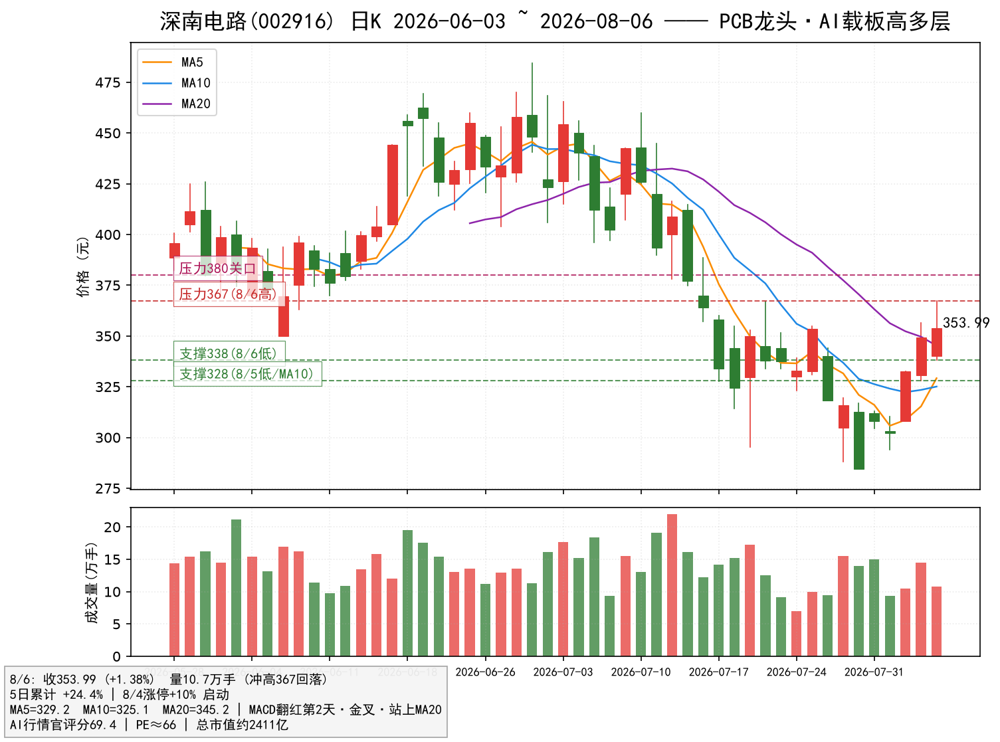
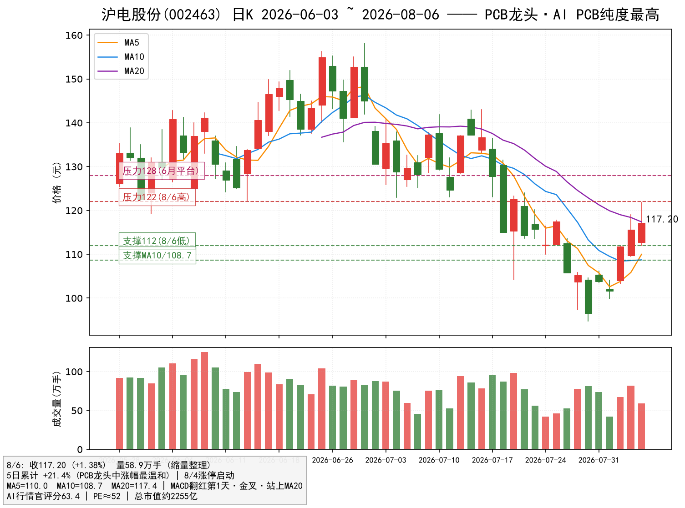

# PCB 潜力龙头双雄调研报告 —— 深南电路(002916) × 沪电股份(002463)

> 报告日期：2026-08-07（数据截至 2026-08-06 收盘）｜性质：板块内个股深度研究（PCB 主线）
> 数据源：AI行情官 评分/信号 + 日K（前复权）+ 腾讯行情（市值/PE）
> 声明：本报告仅为研究与信息整理，**不构成任何投资建议**。股市有风险，入市需谨慎。

---

## 〇、结论先行

1. 大盘"底+金"确认空转多（上证/中证1000 底1+金1），**PCB 是资金主攻 + 技术确认最强的板块**（详见《大盘底金信号板块主攻研判》）；电子板块 5 日主力净流入 +582.7 亿全市场第一；
2. 对 6 只 PCB 龙头做"逻辑 × 数据"双确认筛选，**锁定 2 只潜力龙头**：
   - **深南电路(002916)**：内资 PCB 综合龙头（PCB+封装基板+电子装联），AI 高多层板/载板核心受益；评分 69.4（龙头最高档）、位置 35% 低位、MACD 翻红第 2 天金叉站上 MA20；
   - **沪电股份(002463)**：AI PCB 纯度最高的龙头（AI 服务器/交换机/加速卡 PCB 占比行业第一梯队）；评分 63.4、位置 35%、**5 日 +21.4% 为六只龙头中涨幅最温和（最未透支）**；
3. 核心特征：两只都是"**低位启动（35%）+ 涨幅温和（21~24%）+ 技术确认（金叉站上 MA20）+ 龙头地位**"的潜力结构，属于"刚启动不追高、回踩可上车"的右侧偏早段。

---

## 一、板块逻辑回顾：为什么 PCB 是当前最强主线

- **产业逻辑**：DeepSeek API 涨价 → AI 算力资本开支上行 → 服务器/交换机/加速卡对**高多层板、HDI、封装基板（载板）**需求提升——AI 服务器 PCB 用量为传统服务器数倍，且层数/价值量同步升级；
- **资金面**（板块报告实测）：行业 5 日主力净流入 电子 +582.7 亿（第1）、印制电路板 +252.4 亿、PCB 概念今日 +64.6 亿（第2）——**持续性最好的板块**；
- **技术面**（板块体检）：PCB 成分股评分均值 64.7、健康率 5/6、位置 32~38% 低位——**唯一"资金+技术"双确认满分板块**；
- **风格**：本轮空转多由中小盘成长主导（中证1000 评分 62 最强），PCB 龙头市值 2000~3000 亿、兼具成长弹性与流动性，正对资金口味。

---

## 二、候选筛选：6 只 PCB 龙头 → 锁定 2 只（双确认）

| 标的 | 收盘/当日 | 5日涨幅 | 50日位置 | AI行情官评分 | 市值/PE | 裁决 |
|---|---|---|---|---|---|---|
| **深南电路 002916** | 353.99 / +1.38% | +24.4% | 35% | **69.4** | 2411亿 / 66 | ✅ **入选** |
| **沪电股份 002463** | 117.20 / +1.38% | **+21.4%** | 35% | 63.4 | 2255亿 / **52** | ✅ **入选** |
| 生益科技 600183 | 127.25 / +3.63% | +27.1% | 32% | 69.4 | 3091亿 / 78.7 | ⚠️ 备选（上游材料，PE最高） |
| 胜宏科技 300476 | 250.15 / +5.84% | **+38.7%** | 33% | 60.0 | 2458亿 / 52.5 | ⚠️ 观察（5日涨幅过大、换手8.4%过热） |
| 景旺电子 603228 | 86.32 / **+10%** | +27.3% | **100%** | 62.0 | 864亿 / 75.9 | ⚠️ 观察（涨停创新高，追高不划算） |
| 鹏鼎控股 002938 | 93.85 / +2.98% | +23.4% | 38% | 63.8 | 2175亿 / 58.6 | ⚠️ 观察（FPC以消费电子为主，AI弹性弱） |

**筛选逻辑**：
- **排除追高**：胜宏科技 5 日 +38.7%（风险标签"5日涨幅过大"）、景旺电子创新高（位置 100%）——弹性虽大但短线已透支；
- **排除逻辑弱**：鹏鼎控股 AI 弹性偏弱；生益科技评分高但为上游材料且 PE 78.7 最贵、市值最大，弹性逊于下游 PCB 龙头；
- **入选理由**：深南/沪电同为"低位（35%）+ 涨幅温和（21~24%）+ 评分高（69.4/63.4）+ 龙头地位（AI PCB 最纯正两家）"——**潜力最大、风险收益比最优**。

---

## 三、深南电路（002916）—— 内资 PCB 综合龙头，AI 载板+高多层双轮

### 3.1 逻辑确认
- **行业地位**：内资 PCB 龙头（全球前列），业务覆盖 PCB + 封装基板（FC-BGA 载板）+ 电子装联，是少数"载板+高多层"双轮驱动的公司；
- **AI 受益路径**：AI 服务器主板/加速卡高多层板、交换机 PCB、以及 AI 芯片 FC-BGA 载板国产化——**载板是当前国产化率最低、弹性最大的环节**，公司为稀缺标的；
- **资金面**：PCB 板块 5 日主力 +252.4 亿、概念今日 +64.6 亿，龙头为资金主要承接对象。

### 3.2 数据确认（AI行情官 2026-08-06）
- 评分 **69.4**（6 只龙头中最高档）；标签：MACD 翻红·第 2 天 / 红柱放大 / 均线金叉 / 站上 MA20 / 位置 34%；
- 风险标签：量价背离 / 5日涨幅过大（短线提示）。

### 3.3 近期走势与交易量
- 7/28、7/30 两次跌停（-10%）洗盘至 284.41 → 7/31 +8.3% → **8/4 涨停（+10%）启动** → 8/5 +5.0%（量 14.5 万手）→ 8/6 冲高 367.29 后回落收 353.99（+1.4%，量 10.7 万手）；
- **8/6 长上影+放量**：367 一线存在短线抛压，属于突破 345（MA20）后的首次冲高遇阻，需回踩确认；
- 技术结构：MACD 金叉扩张、站上 MA20（345.2），位置 35% 仍处低位，距 50 日高点 484.57 有 +37% 空间。

### 3.4 技术位与操作
- **支撑**：338（8/6 低点）→ 328~332（8/5 低点 / 8/4 涨停收盘区 / MA10）→ 318（涨停起点）
- **压力**：367（8/6 高点）→ 380（心理关口）→ 更高（50 日高 484.57）
- **买点**：回踩 338~345 不破企稳分批低吸；放量突破 367 加仓
- **止损**：跌破 328（MA10）离场
- **仓位**：单票 ≤1.5 成
- ⚠️ 8/6 长上影说明短线有分歧，不追高开 >3%

---

## 四、沪电股份（002463）—— AI PCB 纯度最高，六龙头中涨幅最温和

### 4.1 逻辑确认
- **行业地位**：AI 服务器/交换机/加速卡 PCB 收入占比行业第一梯队，**AI PCB 纯度最高**的 A 股标的，深度绑定英伟达与北美云厂商链；
- **AI 受益路径**：AI 服务器主板、800G 交换机 PCB、加速卡载板需求放量——**纯度决定弹性**，是 PCB 涨价最直接的传导标的；
- **资金面**：与深南同享板块主力净流入，8/5 单日成交 81.7 万手放量，资金持续介入。

### 4.2 数据确认（AI行情官 2026-08-06）
- 评分 **63.4**；标签：MACD 翻红·第 1 天 / 红柱放大 / 均线金叉 / 站上 MA20 / 首板 / 异动回踩中 / 位置 35%；
- 风险标签：量价背离 / 多次跌停 / 破位下行（前期洗盘遗留标签，随站上 MA20 逐步解除）。

### 4.3 近期走势与交易量
- 7/28 -10%、7/30 -8.3% 深洗至 94.73 → 7/31 +7.5% → **8/4 涨停（+10%）启动** → 8/5 +3.4%（量 81.7 万手阶段峰值）→ 8/6 +1.4%（缩量至 58.9 万手整理）；
- **8/6 收 117.20，刚好收在 MA20（117.39）一线**——突破后首日缩量回踩确认，量价配合（评分量价因子健康）；
- **5 日 +21.4% 为六只龙头中最温和**——相对胜宏（+38.7%）、生益（+27.1%）、景旺（+27.3%），**透支最少、回撤空间相对小**。

### 4.4 技术位与操作
- **支撑**：112（8/6 低点）→ 109.5（8/5 低点）→ 108.7（MA10）→ 103~105（8/3-8/4 平台）
- **压力**：122（8/6 高点）→ 128（6 月平台）→ 前高 158.20（50 日高）
- **买点**：回踩 112~115 不破分批低吸；放量突破 122 加仓
- **止损**：跌破 108.7（MA10）离场
- **仓位**：单票 ≤1.5 成
- ⚠️ 刚站上 MA20，若 8/7 缩量阴线跌回 MA20 下方，则等待 112 支撑企稳再介入

---

## 五、备选与观察

| 标的 | 定位 | 触发条件 |
|---|---|---|
| 生益科技 600183 | 覆铜板（PCB 上游材料）龙头，评分 69.4 | "PCB 放量 → 覆铜板涨价"逻辑顺，但 PE 78.7 最贵、市值最大；回踩 MA20（125.5）企稳可作上游补涨配置 |
| 胜宏科技 300476 | 英伟达链弹性最大（5日 +38.7%） | 短期涨幅过大+换手 8.37% 过热，等回调至 5 日线/缩量分歧后再看 |
| 景旺电子 603228 | 涨停创新高（位置 100%） | 短线最强但位置最高，仅适合激进打板，不符合"潜力"定位 |

---

## 六、组合与风控

| 项目 | 建议 |
|---|---|
| 总仓位 | PCB 主线合计 **≤3 成**，不满仓 |
| 核心 | 深南电路（≤1.5 成）：回踩 338~345 低吸 / 破 367 加仓 |
| 核心 | 沪电股份（≤1.5 成）：回踩 112~115 低吸 / 破 122 加仓 |
| 止损纪律 | 跌破各自 MA10（深南 328 / 沪电 108.7）或单日放量长阴 -8% 无条件离场 |
| 时间窗 | AI 资本开支/中报预告落地前后为催化窗口；板块 5 日涨幅已大，公告落地后警惕"利好兑现" |
| 跟踪指标 | ① 板块 5 日主力资金是否延续净流入 ② 两只次日量能（缩量回踩=良性，放量滞涨=分歧）③ AI行情官 评分是否站稳 60+ ④ 大盘中证1000 是否保持"底金"状态 |

---

## 七、风险提示

1. **短线位置不低**：板块 5 日涨幅普遍 20%+，深南 8/6 长上影、沪电刚站上 MA20，短线分歧加大，追高有回撤风险；
2. **大盘风险**："底+金"为日线级别信号，若上证跌破 MA20（约 3900 一线）则空转多失败，PCB 逻辑同步终止；
3. **基本面依赖**：AI PCB 需求高度依赖海外大厂（英伟达/云厂商）资本开支，若 AI 资本开支不及预期，高估值（PE 52~66）存在戴维斯双杀风险；
4. **口径说明**：市值/PE 来自腾讯行情接口、评分为 AI行情官 技术统计（反映历史量价，不代表未来），数据可能存在滞后与口径差异；
5. **本报告不构成投资建议**，据此操作风险自负。

---

*报告生成：AI行情官智能体｜数据截至 2026-08-06 收盘｜方法：个股级逻辑×数据双确认*
*附录：原始数据存 `数据/k_002916.json`、`数据/k_002463.json`、`数据/pcb_snap_20260807.json`。*