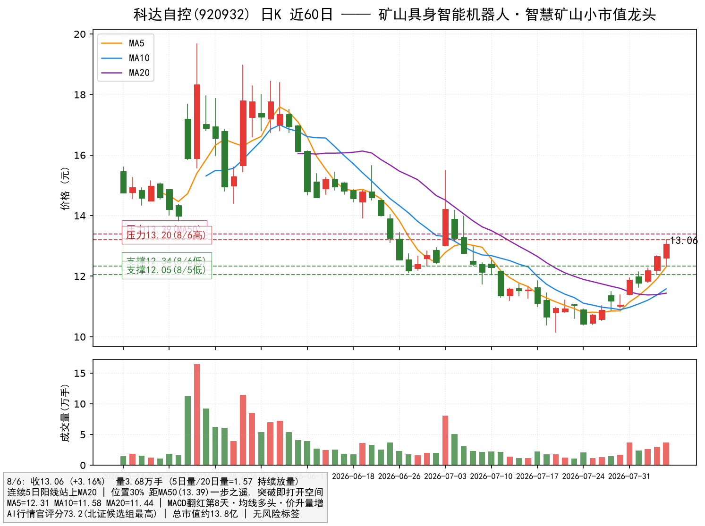
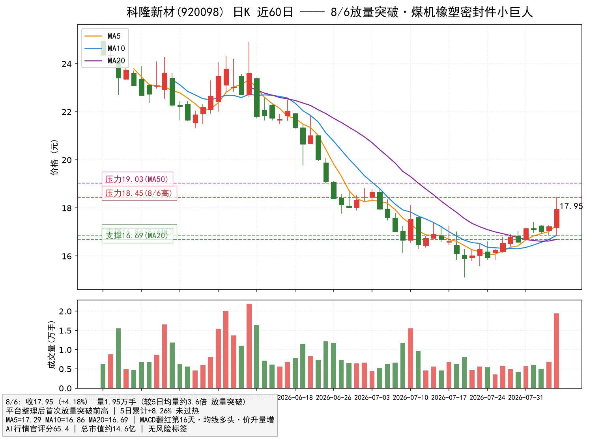
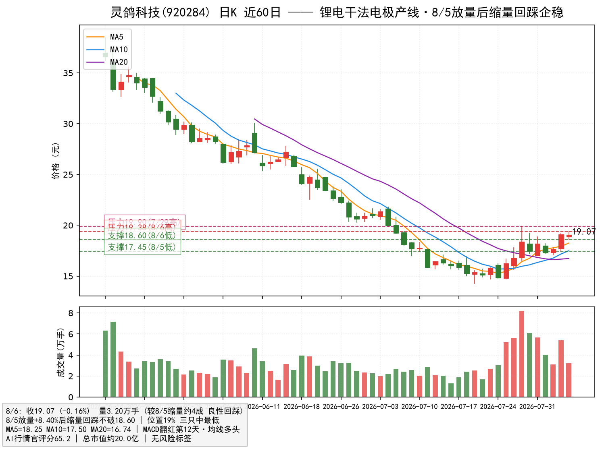

# 北证潜力股推荐（低风险优选版）—— 科达自控(920932) × 科隆新材(920098) × 灵鸽科技(920284)

> 报告日期：2026-08-07（数据截至 2026-08-06 收盘）｜性质：北交所 30CM 潜力标的低风险优选
> 数据源：AI行情官 评分/信号 + 日K（前复权）+ 东财行情
> 声明：本报告仅为研究与信息整理，**不构成任何投资建议**。股市有风险，入市需谨慎。

---

## 〇、先说结论

大盘日线级"底+金"转强（买盘资金开始大于卖盘）背景下，北证 50 是弹性最大的高贝塔方向——**主板涨停才 10%，北证 30CM，同样题材一旦发酵，弹性可达主板 2~3 倍**。按你固化的"低风险优选"标准（底部刚走强/刚突破 + 位置低 + 小市值 + 零风险标签 + 题材与主线共振），对北交所 345 只标的全量扫描后 **锁定 3 只**：

| 锁定 | 标的 | 评分 | 位置 | 市值(总) | 5日涨幅 | 核心逻辑 |
|---|---|---|---|---|---|---|
| ✅ **核心** | **科达自控 920932** | **73.2** | 30% | 13.8亿 | +18.1% | 矿山具身智能机器人+智慧矿山（与宇树/山西焦煤合作） |
| ✅ **核心** | **科隆新材 920098** | 65.4 | 28% | 14.6亿 | +8.3% | 煤机橡塑密封件"小巨人"，8/6 放量突破 |
| ✅ **核心** | **灵鸽科技 920284** | 65.2 | 19% | 20.0亿 | +9.4% | 锂电干法电极自动化产线，位置最低 |

三只标的**均无风险标签、总市值全部 <21亿、位置全部 ≤30%**，符合"底部刚启动、小市值高弹性"标准。科达自控 5 日 +18.1% 相对最热，但位置仅 30%、连续 3 日放量上攻属"启动初期"；灵鸽科技 10 日 +20.7% 略热，但 8/6 已缩量回踩消化获利盘。

---

## 一、为什么做北证 + 仓位策略

- **弹性逻辑**：北证涨跌幅 30%，是 A 股波动天花板。大盘转强（上证"底+金"）后，增量资金优先流入弹性方向，北证小市值标的往往最先被点火；
- **市值逻辑**：北证大量标的市值仅 5~40 亿，题材一旦发酵，10~20 亿盘子容易被资金推动连续大涨，弹性远大于沪深同类；
- **仓位策略（激进但不孤注一掷）**：

| 项目 | 建议 |
|---|---|
| 总仓位 | 主板主线 6~7 成 + 北证组合 3~4 成（北证不超 4 成） |
| 单票上限 | 每只 ≤1.5 成，三只合计 ≤4 成 |
| 入场 | 回踩不破支撑分批低吸；放量突破压力位再加仓（不追高开秒板） |
| 止损纪律 | 破各自止损位 或 单日放量长阴 -8% 无条件离场（30CM 波动大，纪律优先） |
| 兑现 | 第一压力位减半锁盈；冲高大幅放量滞涨即走 |

> 为什么不全仓北证：30CM 是双刃剑，单日 -20% 也常见。北证做"进攻仓位"，主线做"确定性底仓"，两者搭配才扛得住波动。

---

## 二、候选筛选：345 只 → 3 只

### 2.1 筛选漏斗
| 步骤 | 规则 | 结果 |
|---|---|---|
| 全量 | 北交所全部标的（东财 81 板块） | 345 只 |
| 市值过滤 | 总市值 5~40 亿（排除大市值与微盘仙股） | 261 只 |
| 流动性过滤 | 日成交额 ≥3000 万（30CM 无流动性=无买卖盘） | 119 只 |
| 技术体检 | AI行情官 逐只评分/信号（位置、MACD、均线、风险标签） | 66 只（59 只成功） |
| 形态终选 | 无风险标签 + 位置 ≤30% + 评分 ≥60 → K线逐只核实 | **3 只** |

### 2.2 决赛圈对比（2026-08-06 收盘）
| 标的 | 评分 | 位置 | 市值 | 5日涨幅 | 风险标签 | 裁决 |
|---|---|---|---|---|---|---|
| **科达自控 920932** | **73.2** | 30% | 13.8亿 | +18.1% | **无** | ✅ **入选** |
| **科隆新材 920098** | 65.4 | 28% | 14.6亿 | +8.3% | **无** | ✅ **入选** |
| **灵鸽科技 920284** | 65.2 | 19% | 20.0亿 | +9.4% | **无** | ✅ **入选** |
| 七丰精工 920169 | 65.0 | 27% | 15.3亿 | +12.6% | 无 | ❌ 紧固件外销约60%，与主线无关联 |
| 华信永道 920592 | 64.8 | 25% | 18.1亿 | +9.2% | 无 | ❌ 公积金SaaS政务软件，与主线无关联 |
| 倍益康 920199 | **85.4** | 43% | 19.3亿 | +9.7% | 无 | ❌ 7/27 +18.4%、7/29 -11.3%暴涨暴跌，波动过热 |

> 倍益康评分全场最高（85.4），但 7/27 单日 +18.4%、7/29 单日 -11.3%，属于"暴涨暴跌型"，不符合低风险标准，放弃；七丰精工/华信永道技术形态不差，但题材与当前主线（矿山机器人/煤炭/锂电）完全不搭，北证小票没有主线题材很难被资金持续点火。

---

## 三、科达自控（920932）—— 矿山具身智能机器人，北证组评分最高

### 3.1 逻辑确认
- **题材**：智慧矿山 + 矿山具身智能机器人，市场消息面与宇树科技、山西焦煤等签署合作，属"机器人+矿山"双热点交叉；机器人是 2026 年最强主线之一，矿山是机器人最先落地的刚需场景之一；
- **弹性**：总市值约 13.8 亿，北证最小市值梯队，题材发酵时弹性极大；
- **事件催化**：矿山智能化政策 + 机器人产业化落地预期，属于"小市值 + 强主线 + 低位"的典型组合。

### 3.2 数据确认（AI行情官 2026-08-06）
- 评分 **73.2**（北证候选组最高）；标签：MACD翻红·第8天 / 红柱放大 / 均线多头 / 均线金叉×2 / 站上MA20 / 价升量增 / 异动回踩支撑 / 位置30% / 动能偏热 / 量价配合；
- **风险标签：无**；8/6 收 13.06（+3.16%）。

### 3.3 近期走势与交易量（形态验证）
- **7/31 放量 +7.41% 启动**（量 3.7 万手，较前期近翻倍）→ 8/3 缩量洗盘 → **8/4~8/6 三连阳加速**，量能逐日放大（5日量/20日量 = **1.57**），典型的"启动-洗盘-再上攻"；
- 5 日累计 **+18.1%**，位置仅 30%，距 MA50（13.39）一步之遥——**突破 MA50 即打开上方空间**；
- 技术结构：站上 MA5/10/20 多头排列，MACD 翻红第 8 天且红柱放大，价升量增，形态健康。

### 3.4 技术位与操作
- **支撑**：12.34（8/6低）→ **12.05（8/5低，止损线）** → 11.44（MA20）
- **压力**：13.20（8/6高）→ **13.39（MA50，突破确认位）**
- **买点**：回踩 12.05-12.34 不破分批低吸；放量站稳 13.39 加仓
- **止损**：跌破 12.05 离场
- **仓位**：单票 ≤1.5 成
- ⚠️ 三只中短期涨幅最大（5日+18%），若高开冲高回落，耐心等回踩 12.3 附近再上，不追高

---

## 四、科隆新材（920098）—— 煤机橡塑密封件"小巨人"，8/6 放量突破

### 4.1 逻辑确认
- **行业地位**：煤机橡塑密封件细分"小巨人"，客户为大型煤矿/煤机企业，并布局煤矿辅助运输设备，是**煤炭产业链的卖铲人**；
- **共振**：与前面煤炭板块调研（盘江股份/山西焦化）同一主线，煤炭设备更新 + 煤价企稳双逻辑；
- **弹性**：总市值约 14.6 亿，北证小市值，煤炭设备方向稀缺标的。

### 4.2 数据确认（AI行情官 2026-08-06）
- 评分 **65.4**；标签：MACD翻红·第16天 / 红柱放大 / 均线多头 / 均线金叉×2 / 站上MA20 / 价升量增 / 位置28% / 动能偏热；
- **风险标签：无**；8/6 收 17.95（**+4.18%**）。

### 4.3 近期走势与交易量（形态验证）
- 7 月下旬以来 16.4-17.4 **平台整理蓄势**（量能 5000~7000 手）→ **8/6 放量突破前高 18.45**，量 1.95 万手（**较前期均量放大近 3.5 倍**）；
- 5 日累计 **+8.3%**，突破当日才刚放量，**完全不存在追高风险**；
- 技术结构：站上 MA5/10/20 多头排列，MACD 翻红第 16 天，8/6 放量阳线突破为标准的"横盘后首突破"形态。

### 4.4 技术位与操作
- **支撑**：16.84（8/6低）→ **16.69（MA20，止损线）**
- **压力**：18.45（8/6高）→ **19.03（MA50）**
- **买点**：回踩 16.84-17.10 不破分批低吸；放量破 18.45 加仓
- **止损**：跌破 16.69 离场
- **仓位**：单票 ≤1.5 成
- ⚠️ 8/6 刚放量突破，次日可能回踩确认，回踩不破 17.1 即是上车点

---

## 五、灵鸽科技（920284）—— 锂电干法电极产线，位置最低

### 5.1 逻辑确认
- **题材**：锂电正负极材料/干法电极自动化产线设备，是**固态电池/干法电极**新技术主线的卖铲人；干法电极是下一代锂电降本关键工艺；
- **稀缺性**：北证锂电高端设备标的稀缺，题材一旦发酵辨识度高；
- **弹性**：总市值约 20.0 亿，三只中市值最大但仍属小盘；位置 19% 为三只中最低，上方空间最大。

### 5.2 数据确认（AI行情官 2026-08-06）
- 评分 **65.2**；标签：MACD翻红·第12天 / 红柱放大 / 均线多头 / 均线金叉×2 / 站上MA20 / 异动回踩支撑 / 位置19% / 动能偏热；
- **风险标签：无**；8/6 收 19.07（-0.16%）。

### 5.3 近期走势与交易量（形态验证）
- 7/29 放量 **+9.58%** 异动启动 → 8/5 放量 **+8.40%** 再攻 → **8/6 缩量回踩 -0.16%**（量 3.2 万手，较 8/5 缩约 4 成）不破 18.60，属**良性回踩**；
- 5 日 +9.4%、10 日 +20.7% 略热，但 8/6 缩量回踩已消化部分获利盘；
- 技术结构：站上 MA5/10/20 多头排列，MACD 翻红第 12 天，回踩不破前一日低点，量价配合健康。

### 5.4 技术位与操作
- **支撑**：18.60（8/6低）→ **17.45（8/5低，止损线）**
- **压力**：19.38（8/6高）→ **19.90（7/29高）**
- **买点**：回踩 18.0-18.6 区间分批低吸；放量破 19.90 加仓
- **止损**：跌破 17.45 离场
- **仓位**：单票 ≤1.5 成
- ⚠️ 10 日涨幅偏大，若跌破 18.60 且放量，先离场观望

---

## 六、备选与淘汰（不入选原因）

| 标的 | 评分 | 位置 | 为什么不选 |
|---|---|---|---|
| 七丰精工 920169 | 65.0 | 27% | 技术形态合格（5日+12.6%），但紧固件外销约60%，与矿山机器人/煤炭/锂电主线无关联 |
| 华信永道 920592 | 64.8 | 25% | 公积金 SaaS 政务软件，题材独立，北证小票缺主线点火难持续 |
| 倍益康 920199 | 85.4 | 43% | 评分全场最高，但 7/27 +18.4%、7/29 -11.3% 暴涨暴跌，波动过热，不符合低风险标准 |

---

## 七、组合与风控

| 项目 | 建议 |
|---|---|
| 总仓位 | 北证组合合计 **≤4 成**（与主板主线 6~7 成搭配） |
| 核心 | 科达自控（≤1.5 成）：回踩 12.1-12.3 低吸 / 放量破 13.39 加仓 |
| 核心 | 科隆新材（≤1.5 成）：回踩 16.9-17.1 低吸 / 放量破 18.45 加仓 |
| 核心 | 灵鸽科技（≤1 成）：回踩 18.0-18.6 分批 / 放量破 19.90 加仓 |
| 止损纪律 | 破各自止损位（12.05 / 16.69 / 17.45）或单日放量长阴 -8% 无条件离场 |
| 兑现 | 第一压力位减半锁盈（13.20 / 18.45 / 19.38）；30CM 冲高大幅放量滞涨即走 |
| 跟踪 | ① 上证"底+金"是否延续 ② 北证50 量能 ③ 各自主线事件（矿山机器人/煤炭/锂电干法电极）④ AI行情官 评分站稳 60+ |

---

## 八、风险提示

1. **30CM 高波动**：北证单日振幅可达 ±20~30%，回撤速度远快于主板，仓位与止损纪律必须严格执行；
2. **流动性风险**：三只日成交额 3000 万~1 亿级别，大单进出冲击成本高，适合分批小单；
3. **短线过热风险**：科达自控 5日+18%、灵鸽科技 10日+21%，若大盘转弱可能补跌；
4. **大盘风险**：北证是高贝塔方向，上证"底+金"若跌破 MA20，北证逻辑整体终止，应同步减仓；
5. **题材证伪风险**：矿山机器人/干法电极为题材预期，需事件持续兑现，合作协议≠确定业绩；
6. **数据口径**：市值/评分来自公开接口，可能滞后或有口径差异；AI行情官评分为技术统计，不代表未来走势；
7. **本报告不构成投资建议**，据此操作风险自负。

---

*报告生成：AI行情官智能体｜数据截至 2026-08-06 收盘｜方法：北证小市值 + 底部刚启动 + 零风险标签 + 题材共振的三票优选*
*附录：原始数据存 `数据/snap_batch_20260807.json`、`数据/klines_20260807.json`；信号分享卡为 AI行情官「信号分享卡」模块截图（含技术快照评分与邀请码 BWPX3Z8B）。*