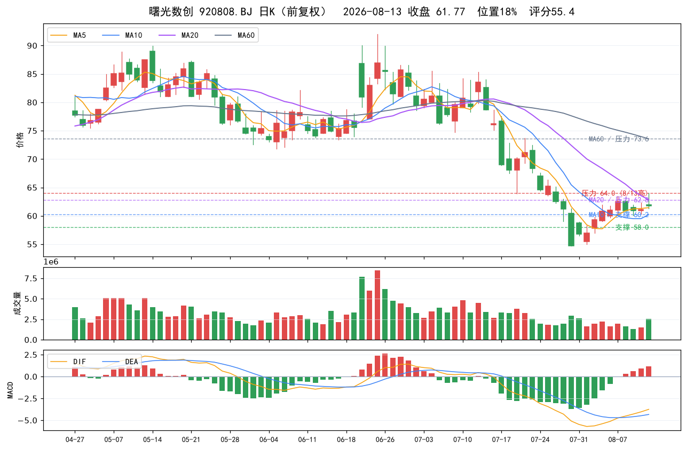

# 液冷服务器调研：曙光数创（920808.BJ）稀缺性 / 技术 / 业绩 / 竞品对比

> 数据截至 2026-08-13 收盘（报告日 2026-08-14）
> 数据来源：AI行情官本地评分接口（18011，内部直算不扣配额）、东财行情、公司公告、券商研报、公开报道

## 结论速览（逻辑×数据双确认框架）

| 关卡 | 结论 | 依据 |
|---|---|---|
| 逻辑关（买什么） | **通过，强逻辑** | 国内唯一大规模商业化浸没相变液冷企业、连续四年液冷市占率第一（>50%）、全球首发 MW 级浸没整机柜 C8000 V3.0、深度绑定中科曙光 ScaleX 万卡超集群 |
| 数据关（何时买） | **未确认** | AI行情官评分 55.4（<60）、收 61.77 仍在 MA20（62.83）下方、带"量价背离/破位下行"风险标签；但已现 MACD 翻红第 4 天 + 8/11"金1"信号、位置 18% 低位修复 |

**定位：强逻辑 + 右侧待确认的高波动进攻品种。** 稳妥做法是等放量站稳 MA20（约 63）并突破 64 再参与；激进小仓可试错，严格止损 58。8/25 中报是下一个验证点。

---

## 一、产业逻辑：液冷为什么是当前算力链主线

- **渗透率陡峭上行**：TrendForce 口径，AI 数据中心液冷渗透率从 2024 年 14% → 2025 年 33% → 2026E 约 40%；中商产业研究院口径，中国液冷服务器渗透率 2021 年不足 3% → 2025 年约 20% → 2026E 约 37% → 2027 年超 50%。
- **市场空间**：TrendForce 预计 2026 年全球 AI 数据中心液冷整体市场约 165 亿美元（约 1162 亿人民币），行业 CAGR 约 59%。
- **驱动力**：单机柜功率从数十 kW 爬升至数百 kW（万卡集群、100% 液冷机架），风冷散热触及物理瓶颈；PUE 管控（浸没方案可做到 1.04）倒逼绿色数据中心采用液冷。
- **技术路线**：冷板液冷（当前主流、交付快）与浸没相变液冷（高密度天花板、壁垒更高）并行；配套环节 CDU / Manifold / 冷媒 / 整机柜。
- **情绪面（08-13）**：液冷服务器板块 +0.76%、主力净流入 30.08 亿；液冷概念净流入 27.36 亿；佳力图涨停；浪潮信息 +5.92% 放量、紫光股份涨停、中科曙光 +3.71%，算力/液冷链资金明显回流。

## 二、稀缺性：为什么是曙光数创

1. **国内唯一实现浸没相变液冷大规模商业化部署**：据中国电子技术标准化研究院《中国算力基础设施液冷技术发展现状分析》，公司温控设备出货量连续四年蝉联国内算力中心基础设施液冷市场榜首，市占率超 50%（含冷板+浸没；公司 2026-05-06 调研纪要确认）。
2. **全球首个 MW 级相变浸没液冷整机柜（C8000 V3.0）**：2026-04-08 战略发布会正式发布，单机柜功率最高超 900kW、达 MW 级，是传统液冷方案 3-5 倍，散热能力超 200W/cm²，采用自研国产冷媒，PUE 低至 1.04；同步成立 MW 级浸没相变液冷基础设施开放实验室。
3. **深度绑定中科曙光国产万卡体系**：中科曙光 ScaleX640 单机柜超节点（单机柜 640 卡）与 ScaleX 万卡超集群以浸没相变液冷为标配级方案；2026-02 万卡超集群已在国家超算互联网核心节点上线运营。
4. **全栈能力**：自研冷媒 → CDU → 整机柜 → 基础设施整体解决方案 →"液冷即服务"；C7000-F 相变冷板（2025-06 发布，散热提升 15%、温度降 5℃+）；已完成上千台服务器"风改液"改造案例；20+ 数据中心落地。
5. **海外卡位**：东南亚累计落地约 200MW 液冷项目；中东已签独家战略合作框架（因战争暂缓交付）；北美进入研发打样；"新加坡总部 + 马来西亚实验室 + 青岛工厂"三地协同。
6. **产能/产业化加码**：2026-08-12 公告以自有资金 1 亿元设立全资子公司"曙光数创创新冷却技术（昆山）有限公司"，聚焦液冷技术及芯片级散热产业化。

> 注：公司证券代码由 872808 变更为 920808（北交所代码段切换，2025-09-30 后旧代码行情停更），行情/数据均以 920808 为准。

## 三、技术性拆解

| 维度 | 曙光数创 | 行业对照 |
|---|---|---|
| 主攻路线 | 浸没相变（两相）+ 冷板双线 | 英维克/申菱/高澜以冷板+CDU 为主 |
| 单机柜功率上限 | ≥900kW（MW 级） | 冷板路线普遍 100-150kW 量级 |
| 散热能力 | >200W/cm² | 冷板多在 60-120W/cm² |
| 冷媒 | 自研国产冷媒（环保/供应链自主） | 多数外购、以水/乙二醇或氟化液为主 |
| 典型案例 | ScaleX 万卡集群、国家级高功率密度数据中心 | 单柜级/机房级项目居多 |
| PUE | 浸没方案可至 1.04 | 风冷 1.3-1.5，冷板 1.15-1.25 |

**技术壁垒**：冷媒配方、密封与腐蚀控制、运维体系、整机柜集成；浸没方案验证周期长、头部客户粘性高（公司调研纪要口径）。**需要清醒的一点**：冷板仍是当前行业主流交付形态，浸没大规模放量仍在爬坡，公司收入确认高度项目制（Q4 占全年 60%+），季度波动大。

## 四、业绩增长性

**2025 年报**（已披露）：
- 营收 8.82 亿元，同比 +74.29%
- 归母净利润 3689.77 万元，同比 -39.93%；扣非净利润同比 +52.52%
- 结构亮点：**浸没液冷收入 4.579 亿元，同比 +370.58%，占比 51.9%，毛利率 36.49%**（高毛利主引擎）；冷板液冷 2.986 亿元，同比 +10.36%

**2026 一季报**（已披露）：
- 营收 1.03 亿元，同比 +782.53%（低基数下的爆发式增长）
- 归母净利润 -4759.53 万元，亏损同比扩大 51.71%
- 毛利率 3.52%（去年同期 -17.21%，同比大幅改善但仍低）
- 亏损原因：销售费用 +43.54%、管理费用 +60.09% 随业务扩张刚性增长；备货致银行贷款增加
- 前瞻指标：**合同负债 1.08 亿元，同比 +68.39%**（在手订单先行指标）；存货 4.6 亿元，同比 +24%（备货）
- 季节性：Q4 收入占全年 60%+、费用全年均匀发生 → Q1 亏损属于结构性现象，兑现看 Q3/Q4

**2026 中报**：8/25 披露，目前无业绩预告；母公司中科曙光 2026H1 快报归母 9.78 亿元、同比 +34.19%（算力链景气佐证）。

**估值**：PE-TTM 亏损（-64.9）、PB 17.54 → 市场按"成长期权"定价，股价对中报兑现度高度敏感。

## 五、交易/资金面（08-13 收盘）

**行情快照**：收盘 61.77（+1.03%），日内高 64.00 / 低 61.27；总市值 123.5 亿、流通市值 120.3 亿（流通占比 97.4%）；换手 1.32%、量比 1.61、成交 1.6 亿元（北证小票活跃度温和）；北交所 30cm 涨跌幅（涨停 79.48 / 跌停 42.80）。

**AI行情官评分 55.4**（技术体检，非选股结论）：
- 正面：MACD 翻红第 4 天、红柱放大、均线金叉、价升量增、位置 18%、低位修复、波动收敛；8/11 出现"金1"信号
- 负面风险标签：量价背离、破位下行、跌破双均线（前期下跌趋势残留）
- 均线：MA5 61.44 / MA10 60.21 / MA20 62.83 / MA60 73.56（**收盘仍低于 MA20**）
- 区间涨幅：5 日 +1.23%、10 日 +12.97%、20 日 -18.98%、60 日 -28.1%（7/30 见低 54.68 后修复中）
- 量能：08-13 成交量 256 万股 vs 20 日均量 228 万股（1.13 倍，温和放量）

**大盘环境（08-13）**：上证 3926.96 站上 MA20、MACD 红柱、均线多头；中证1000 7715.89 站上 MA20、红柱第 9 天、均线多头；创业板站上 MA20、红柱第 7 天。大盘顺风，中小盘成长占优，利于北证/题材弹性标的。

## 六、技术位与操作

| 类型 | 位置 | 说明 |
|---|---|---|
| 支撑 1 | 60.2 | MA10 + 8/7-8/10 回踩平台 |
| 支撑 2 | 58.0 | 8/3-8/4 启动平台（关键） |
| 支撑 3 | 56.5 | 7/31 低点 |
| 压力 1 | 62.8-63.4 | MA20 + 8/7 高点 |
| 压力 2 | 64.0 | 8/13 日内高点 |
| 压力 3 | 68-70 | 7/17-7/23 密集区 |
| 压力 4 | 73.6 | MA60 |

- **右侧确认信号**：放量站稳 MA20（约 63）并突破 64，技术结构转为多头。
- **止损纪律**：激进试错仓止损 58（平台破位），严格者 56.5；北交所 30cm 波动大，**破止损或单日放量长阴 -8% 无条件离场**。
- **仓位纪律**（沿用北证框架）：单票 ≤1.5 成、进攻仓合计 ≤4 成，主板主线 6-7 成做确定性底仓。
- **事件催化**：8/25 中报（重点看浸没液冷收入、毛利率、合同负债）；C8000 V3.0 与万卡集群订单落地；昆山子公司产能爬坡；海外（东南亚/北美）订单。

## 七、竞品对比（08-13 收盘）

| 标的 | 代码 | 收盘价 | 总市值 | PE-TTM | AI评分 | 2025 营收/净利 | 液冷纯度与看点 |
|---|---|---|---|---|---|---|---|
| **曙光数创** | 920808 | 61.77 | 123.5亿 | 亏损 | 55.4 | 8.82亿 +74% / 净利 -40% | 浸没相变唯一大规模商业化，液冷纯度最高，绑定中科曙光万卡 |
| 英维克 | 002837 | 55.45 | 706.6亿 | 2040 | 53.2 | 60.68亿 +32% / 5.22亿 +15% | 温控龙头，机房温控 34.48 亿占 56.8%，但液冷真实收入占比仅 7-8%（花旗）；2026Q1 净利 -82% |
| 申菱环境 | 301018 | 90.00 | 336.9亿 | 297.5 | 56.2 | 42.09亿 +39.6% / 2.17亿 +87.6% | 数据服务 23.43 亿占 55.7%，液冷 CDU 厂商第一，高州二期 9 月投产 + 北美 |
| 高澜股份 | 300499 | 28.31 | 86.4亿 | 142.7 | 58.0 | 9.89亿 / 2838万 +156% | 工业热管理，困境反转扭亏；AI 液冷毛利率仅 17%（质量一般） |
| 同飞股份 | 300990 | 73.15 | 125.2亿 | 52.4 | 55.4 | 28.67亿 +32.8% / 2.53亿 +64.8% | 储能温控为主，液冷新拓展；PE 最低但纯度低 |
| 依米康 | 300249 | 12.88 | 59.0亿 | 157.3 | 65.0 | 扭亏（净利 3059万） | 小市值液冷+IDC，评分最高但量价背离/长上影滞涨 |
| 工业富联 | 601138 | 65.23 | 12944亿 | 27.3 | 78.6 | 9029亿 +48% / 353亿 +52% | 整机/ODM 龙头，液冷为配套属性 |
| 浪潮信息 | 000977 | 79.46 | 1166.9亿 | 48.2 | 48.0 | 1648亿 +44% / 24.13亿 +5% | 服务器龙头，8/13 +5.92% 放量 |
| 中科曙光 | 603019 | 89.63 | 1311.4亿 | 67.1 | 38.4 | 2026H1 快报 9.78亿 +34% | 母公司/整机+算力，液冷由子公司承接 |

**对比结论**：
- **液冷纯度/稀缺性**：曙光数创 > 申菱/英维克 > 高澜/同飞/依米康 > 整机厂。
- **业绩确定性**：申菱环境最扎实（数据服务 +51%、CDU 第一、产能落地），同飞 PE 最低但储能为主，英维克 2026Q1 业绩变脸 + 液冷占比低。
- **弹性**：曙光数创（浸没唯一标的 + 30cm + 亏损低基数）弹性最大，波动也最大；依米康小市值评分高但形态有瑕疵。
- 若按老板"低风险优选"标准衡量（位置 ≤30% ✓、零风险标签 ✗、市值 30-150 亿 ✓、无亏损硬伤 ✗、评分 ≥60 ✗），**曙光数创不属于低风险池，属于高赔率高波动的进攻品种**。

## 八、风险提示

1. **业绩亏损 + 低毛利率**：2026Q1 亏损扩大、毛利率仅 3.52%，全年兑现高度依赖 Q3/Q4 项目确认；中报（8/25）若浸没放量不及预期，估值（PB 17.5、PE 亏损）回调空间大。
2. **收入季节性**：Q4 占全年 60%+，季度间利润大幅波动，易被误读。
3. **治理结构**：2026-04 中科曙光变更为无实控人/无控股股东（中科算源持股降至 14.68%）；董事长兼总经理历军 5 月披露减持计划，已于 6/22 提前终止（累计减持 229.99 万股）。
4. **经营现金流**：2025 年度经营现金流同比 -316%，项目制垫资 + 备货压力。
5. **海外地缘**：中东项目因战争暂缓，海外收入确认节奏不确定。
6. **技术面**：评分 55.4 < 60、量价背离标签、收盘未站上 MA20、60 日仍 -28%，属弱势修复初期；30cm 涨跌幅 + 高流通占比，单日波动剧烈。
7. **技术路线竞争**：若行业主流加速转向冷板/成本压力加大，浸没放量节奏可能低于预期。
8. **限售解禁**：8/3 已解禁 18.91 万股（占总股本 0.0946%），体量极小，暂无实质压力；后续关注大股东/董监高动向。

---

**声明：本报告基于公开信息与本地量化接口整理，仅供研究参考，不构成任何投资建议。股市有风险，入市需谨慎。**
